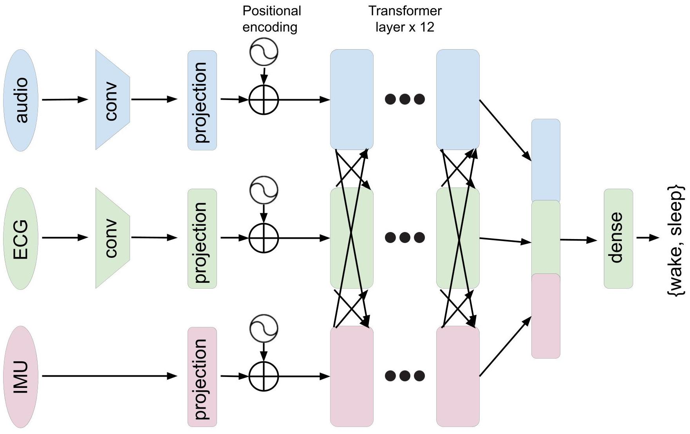
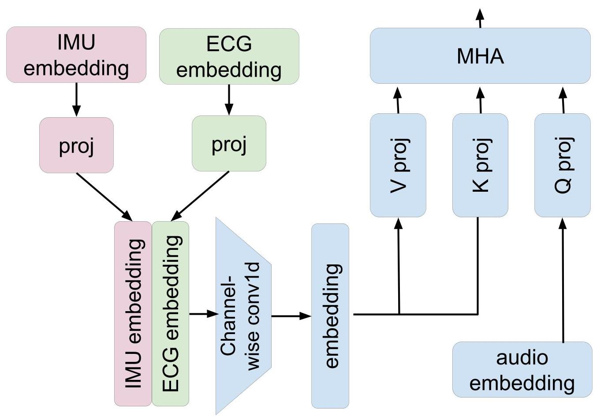

# Classification of Infant Sleep/Wake States

<p align="center">
         
        
        <em>The LittleBeats Model Architecture (left) and Cross-attention for the audio branch (right).</em>
</p>

> K. C. Chang, M. Hasegawa-Johnson, N. L. McElwain, and B. Islam, Classification of Infant Sleep/Wake States: Cross-Attention among Large Scale Pretrained Transformer Networks using Audio, ECG, and IMU Data. 2023. [[arXiv]](https://arxiv.org/abs/2306.15808) [IEEE Eplore]

Accepted by 2023 Asia Pacific Signal and Information Processing Association Annual Summit and Conference (APSIPA ASC) 

This project code is based on [](https://github.com/huggingface/transformers/blob/v4.32.1/src/transformers/models/wav2vec2/modeling_wav2vec2.py) and [](https://github.com/dapowan/LIMU-BERT-Public)

## Infant Sleep/Wake Classification
Infant sleep is critical to brain and behavioral development. 
Prior studies on infant sleep/wake classification have been largely limited to reliance on expensive and burdensome 
polysomnography (PSG) tests in the laboratory or wearable devices that collect single-modality data. 
To facilitate data collection and accuracy of detection, we aimed to advance this field of study by using a 
multi-modal wearable device, LittleBeats (LB), to collect audio, electrocardiogram (ECG), and inertial 
measurement unit (IMU) data among a cohort of 28 infants. We employed a 3-branch (audio/ECG/IMU) large scale 
transformer-based neural network (NN) to demonstrate the potential of such multi-modal data. We pretrained 
each branch independently with its respective modality, then finetuned the model by fusing the pretrained 
transformer layers with cross-attention. We show that multi-modal data significantly improves sleep/wake 
classification (accuracy = 0.880), compared with use of a single modality (accuracy = 0.732). 
Our approach to multi-modal mid-level fusion may be adaptable to a diverse range of architectures and tasks, 
expanding future directions of infant behavioral research.

## Dataset
Due to privacy, we are unable to provide the dataset used for this paper. Please prepare:
1. synchronized audio (sampling frequency 16000Hz), ecg (sampling frequency 16000Hz), and imu
data (sampling frequency 150Hz, space separated .csv file with 6 entries (acceleration x,y,z + gyroscope x,y,z) per row)
2. manifest/train.csv, manifest/val.csv, manifest/test.csv (each follow the same format as provided manifest/sample.csv)

## Pretraining Audio or ECG branch
1. Followed the pretraining procedure released by [Facebook](https://github.com/facebookresearch/fairseq/blob/main/examples/wav2vec/README.md) for both audio and ecg
2. Copy the weights into manifest/pretrained_weights

## Pretraining IMU branch
This is modified from [](https://github.com/dapowan/LIMU-BERT-Public)
1. Prepare dataset/littlebeats_pretrain
2. Run the following pretraining command
```
python limu_bert/pretrain.py v4 littlebeats_pretrain 20_120 -s limu_v4_sep12
```
3. Copy limu_v4_sep12.pt into manifest/pretrained_weights/limu

## Prepare Environment

This code is tested on Windows 11 with Python 3.9, CUDA 11.6 and Pytorch 1.13


## Training
```
sleep_classifier_w2v_audio_ecg 
--train
--ckpt_path
"D:\Projects\LittleBeatsPrelim_HAL\LittleBeatsPrelim\manifest\w2v-audio-and-ecg\checkpoint-best"
--cache_path
"D:\Projects\datasets\.cache\huggingface\datasets"
--embedding_type
"audio"
--limu_pretrained_model
"path to limu_v4_sep12.pt"
--mode
"triple"
```

## Evaluation
```
sleep_classifier_w2v_audio_ecg 
--eval
--ckpt_path
"D:\Projects\LittleBeatsPrelim_HAL\LittleBeatsPrelim\manifest\w2v-audio-and-ecg\checkpoint-best"
--cache_path
"D:\Projects\datasets\.cache\huggingface\datasets"
--embedding_type
"audio"
--limu_pretrained_model
"path to limu_v4_sep12.pt"
--mode
"triple"
```
